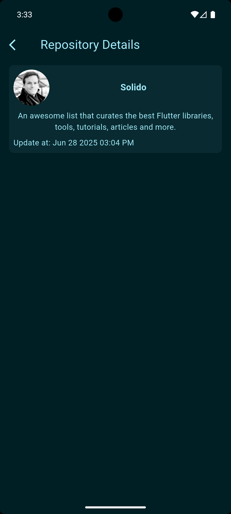

# Flutter Task

A Flutter application with multi-environment configuration support.

## Project Overview

This project is set up with a clean architecture and supports multiple environments (Development, QA, Production) using Flutter flavors.

## UI Showcase

This application implements a modern e-commerce product listing with features like:
- Grid layout for product display
- Product details including name, pricing, and ratings
- Discount percentage calculation
- Favorite/wishlist functionality

<div style="display: flex; flex-direction: row; gap: 16px;">
    
    
    
</div>


## Project Structure

```
lib/
├── core/              
│   ├── app_context.dart
│   ├── base/         
│   ├── bloc/         
│   ├── di/           
│   ├── exceptions/    
│   ├── network/       
│   ├── routes/        
│   ├── services/      
│   ├── theme/         
│   ├── utils/         
│   └── values/       
├── features/          
│   └── home/          
├── flavors/           
│   ├── build_config.dart
│   ├── env_config.dart
│   └── environment.dart
├── main_dev.dart      
├── main_prod.dart     
├── main_qa.dart       
└── my_app.dart        
```

## Environment Configuration

The app supports three environments:
- Development (DEV)
- Quality Assurance (QA)
- Production (PROD)

## Getting Started

### Prerequisites
- Flutter SDK
- Dart SDK
- Android Studio / VS Code with Flutter plugins

### Running the Application

To run the application in different environments, use the following commands:

#### Development Environment
```
flutter run --flavor development -t lib/main_dev.dart
```

#### QA Environment
```
flutter run --flavor qa -t lib/main_qa.dart
```

#### Production Environment
```
flutter run --flavor production -t lib/main_prod.dart
```

### Building the Application

#### Android
```
flutter build apk --flavor development -t lib/main_dev.dart
flutter build apk --flavor qa -t lib/main_qa.dart
flutter build apk --flavor production -t lib/main_prod.dart
```

#### iOS
```
flutter build ios --flavor development -t lib/main_dev.dart
flutter build ios --flavor qa -t lib/main_qa.dart
flutter build ios --flavor production -t lib/main_prod.dart
```

## Resources

- [Flutter Documentation](https://docs.flutter.dev/)
- [Dart Documentation](https://dart.dev/guides)
